Exploratory Analysis of Pseudo Facebook Data
================================

#### Link to [Pseudo Facebook Data]()

Loading the dataset
-------------------

    pf <- read.csv('pseudo_facebook.tsv', sep = '\t')
    names(pf)

    ##  [1] "userid"                "age"                  
    ##  [3] "dob_day"               "dob_year"             
    ##  [5] "dob_month"             "gender"               
    ##  [7] "tenure"                "friend_count"         
    ##  [9] "friendships_initiated" "likes"                
    ## [11] "likes_received"        "mobile_likes"         
    ## [13] "mobile_likes_received" "www_likes"            
    ## [15] "www_likes_received"

    dim(pf)

    ## [1] 99003    15

    str(pf)

    ## 'data.frame':    99003 obs. of  15 variables:
    ##  $ userid               : int  2094382 1192601 2083884 1203168 1733186 1524765 1136133 1680361 1365174 1712567 ...
    ##  $ age                  : int  14 14 14 14 14 14 13 13 13 13 ...
    ##  $ dob_day              : int  19 2 16 25 4 1 14 4 1 2 ...
    ##  $ dob_year             : int  1999 1999 1999 1999 1999 1999 2000 2000 2000 2000 ...
    ##  $ dob_month            : int  11 11 11 12 12 12 1 1 1 2 ...
    ##  $ gender               : Factor w/ 2 levels "female","male": 2 1 2 1 2 2 2 1 2 2 ...
    ##  $ tenure               : int  266 6 13 93 82 15 12 0 81 171 ...
    ##  $ friend_count         : int  0 0 0 0 0 0 0 0 0 0 ...
    ##  $ friendships_initiated: int  0 0 0 0 0 0 0 0 0 0 ...
    ##  $ likes                : int  0 0 0 0 0 0 0 0 0 0 ...
    ##  $ likes_received       : int  0 0 0 0 0 0 0 0 0 0 ...
    ##  $ mobile_likes         : int  0 0 0 0 0 0 0 0 0 0 ...
    ##  $ mobile_likes_received: int  0 0 0 0 0 0 0 0 0 0 ...
    ##  $ www_likes            : int  0 0 0 0 0 0 0 0 0 0 ...
    ##  $ www_likes_received   : int  0 0 0 0 0 0 0 0 0 0 ...

    summary(pf)

    ##      userid             age            dob_day         dob_year   
    ##  Min.   :1000008   Min.   : 13.00   Min.   : 1.00   Min.   :1900  
    ##  1st Qu.:1298806   1st Qu.: 20.00   1st Qu.: 7.00   1st Qu.:1963  
    ##  Median :1596148   Median : 28.00   Median :14.00   Median :1985  
    ##  Mean   :1597045   Mean   : 37.28   Mean   :14.53   Mean   :1976  
    ##  3rd Qu.:1895744   3rd Qu.: 50.00   3rd Qu.:22.00   3rd Qu.:1993  
    ##  Max.   :2193542   Max.   :113.00   Max.   :31.00   Max.   :2000  
    ##                                                                   
    ##    dob_month         gender          tenure        friend_count   
    ##  Min.   : 1.000   female:40254   Min.   :   0.0   Min.   :   0.0  
    ##  1st Qu.: 3.000   male  :58574   1st Qu.: 226.0   1st Qu.:  31.0  
    ##  Median : 6.000   NA's  :  175   Median : 412.0   Median :  82.0  
    ##  Mean   : 6.283                  Mean   : 537.9   Mean   : 196.4  
    ##  3rd Qu.: 9.000                  3rd Qu.: 675.0   3rd Qu.: 206.0  
    ##  Max.   :12.000                  Max.   :3139.0   Max.   :4923.0  
    ##                                  NA's   :2                        
    ##  friendships_initiated     likes         likes_received    
    ##  Min.   :   0.0        Min.   :    0.0   Min.   :     0.0  
    ##  1st Qu.:  17.0        1st Qu.:    1.0   1st Qu.:     1.0  
    ##  Median :  46.0        Median :   11.0   Median :     8.0  
    ##  Mean   : 107.5        Mean   :  156.1   Mean   :   142.7  
    ##  3rd Qu.: 117.0        3rd Qu.:   81.0   3rd Qu.:    59.0  
    ##  Max.   :4144.0        Max.   :25111.0   Max.   :261197.0  
    ##                                                            
    ##   mobile_likes     mobile_likes_received   www_likes       
    ##  Min.   :    0.0   Min.   :     0.00     Min.   :    0.00  
    ##  1st Qu.:    0.0   1st Qu.:     0.00     1st Qu.:    0.00  
    ##  Median :    4.0   Median :     4.00     Median :    0.00  
    ##  Mean   :  106.1   Mean   :    84.12     Mean   :   49.96  
    ##  3rd Qu.:   46.0   3rd Qu.:    33.00     3rd Qu.:    7.00  
    ##  Max.   :25111.0   Max.   :138561.00     Max.   :14865.00  
    ##                                                            
    ##  www_likes_received 
    ##  Min.   :     0.00  
    ##  1st Qu.:     0.00  
    ##  Median :     2.00  
    ##  Mean   :    58.57  
    ##  3rd Qu.:    20.00  
    ##  Max.   :129953.00  
    ## 

Univariate Analysis
-------------------

### Histogram of Users' Birthdays

    library(ggplot2)
    qplot(x = dob_day, data = pf, color = I('black'), fill = I('blue'))+
      scale_x_continuous(breaks=1:31)

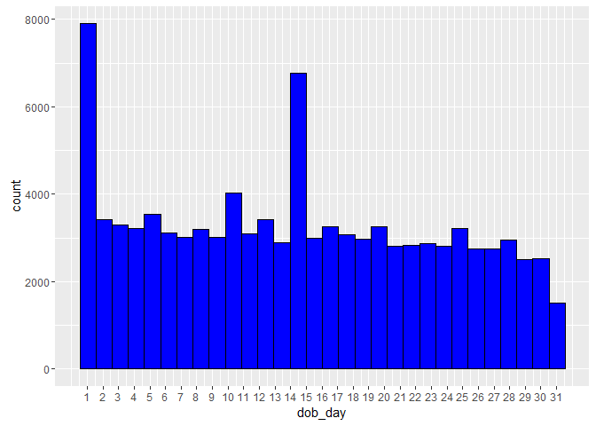

### Faceting

    qplot(x = dob_day, data = pf)+
      facet_wrap(~dob_month, ncol = 3)+
      scale_x_continuous(breaks=1:31)

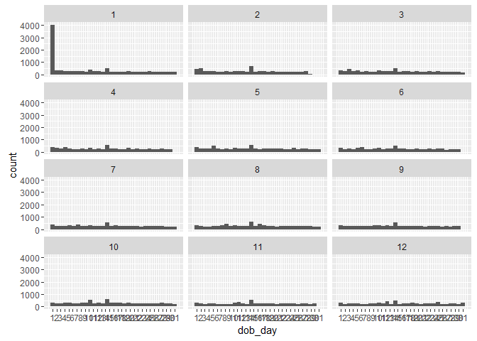

### Friend Count

    qplot(x = friend_count, data = pf)

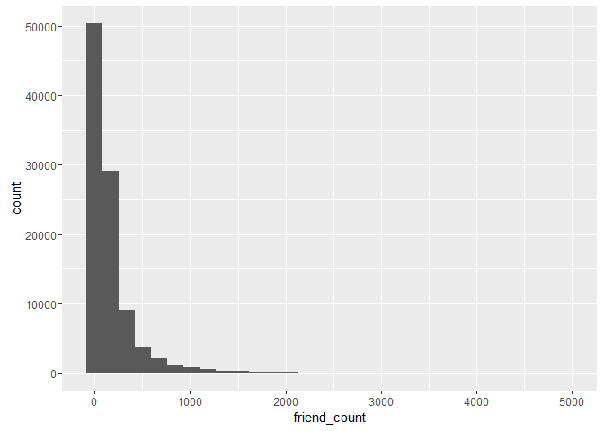

### Limiting X-axis

    qplot(x = friend_count, data = pf, fill = I('purple'), color = I('black'))+
      scale_x_continuous(limits = c(0, 1000))

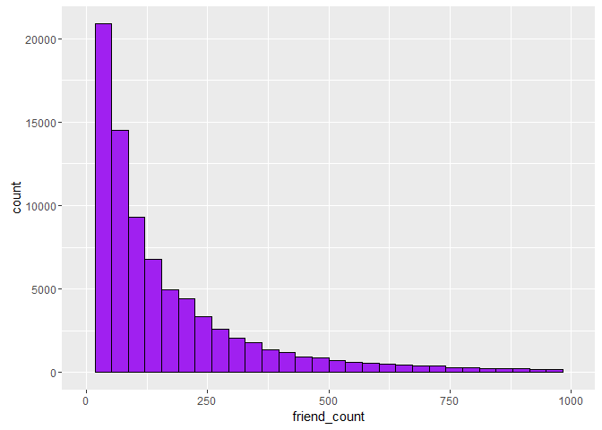

### On basis of Gender

    qplot(x = friend_count, data = pf, binwidth = 25, fill = I('purple'), color = I('black')) +
      scale_x_continuous(limits = c(0, 1000),
                         breaks = seq(0, 1000, 50))+
      facet_wrap(~gender, ncol = 1)

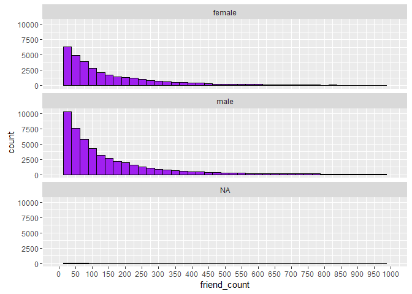

### Limiting gender to male and female

    qplot(x = friend_count, data = subset(pf, !is.na(gender)), binwidth = 25,
          fill = I('purple'), color = I('black')) +
      scale_x_continuous(limits = c(0, 1000),
                         breaks = seq(0, 1000, 50))+
      facet_wrap(~gender, ncol = 1)

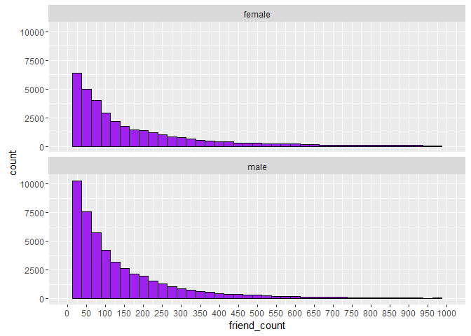

### Summary

    table(pf$gender)

    ## 
    ## female   male 
    ##  40254  58574

    by(pf$friend_count, pf$gender, summary)

    ## pf$gender: female
    ##    Min. 1st Qu.  Median    Mean 3rd Qu.    Max. 
    ##       0      37      96     242     244    4923 
    ## -------------------------------------------------------- 
    ## pf$gender: male
    ##    Min. 1st Qu.  Median    Mean 3rd Qu.    Max. 
    ##       0      27      74     165     182    4917

### Tenure

    qplot(x = tenure, data = pf, binwidth = 30, color = I('black'),
          fill = I('blue'))

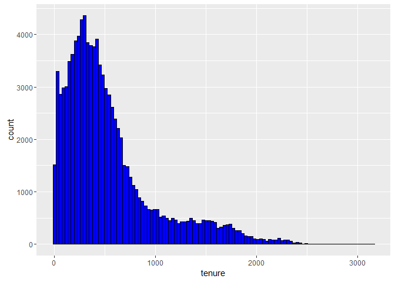

### Tenure in years

    qplot(x = tenure/365 , data = pf, binwidth = .25, color = I('black'),
          xlab = 'Number of years using facebook',
          ylab = 'Numbers of users in sample',
          fill = I('blue'))+
      scale_x_continuous(breaks = seq(1, 7, 1), limits = c(0, 7))

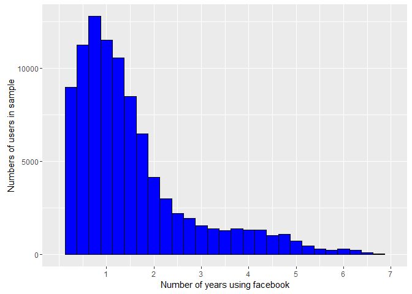

### Age

    qplot(x = age, data = pf, color = I('black'), binwidth = 1)+
      scale_x_continuous(breaks = seq(0, 113, 5))

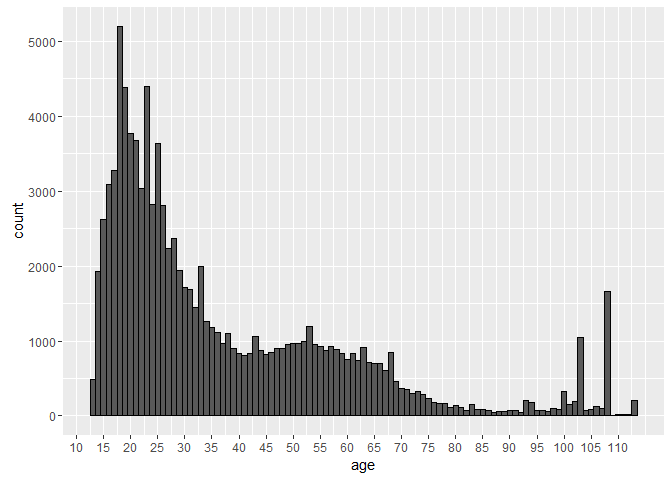

### Adjusting the x scale

    summary(pf$friend_count)

    ##    Min. 1st Qu.  Median    Mean 3rd Qu.    Max. 
    ##     0.0    31.0    82.0   196.4   206.0  4923.0

    summary(log10(pf$friend_count+1))

    ##    Min. 1st Qu.  Median    Mean 3rd Qu.    Max. 
    ##   0.000   1.505   1.919   1.868   2.316   3.692

    summary(sqrt(pf$friend_count))

    ##    Min. 1st Qu.  Median    Mean 3rd Qu.    Max. 
    ##   0.000   5.568   9.055  11.090  14.350  70.160

    library(gridExtra)

    p1 <- qplot(x = friend_count, data = pf, fill = I('purple'), color = I('black'))
    p2 <- qplot(x = log10(friend_count+1), data = pf, fill = I('purple'), color = I('black'))
    p3 <- qplot(x = sqrt(friend_count), data = pf, fill = I('purple'), color = I('black'))
    grid.arrange(p1, p2, p3, ncol = 1)

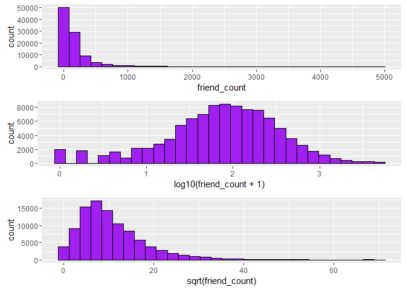

### Propotion of friend count

    qplot(x = friend_count, y = ..count../sum(..count..),
          data = subset(pf, !is.na(gender)),
          xlab = 'Friends Count',
          ylab = 'Proportion of users with that friend count',
          binwidth = 10,
          geom = 'freqpoly', color= gender)+
      scale_x_continuous(limits = c(0,1000), breaks = seq(0,1000,50))

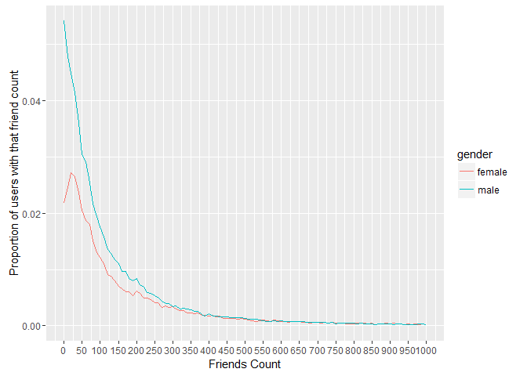

### Likes recieved

    qplot(x = www_likes, data = subset(pf, !is.na(gender)),
          geom = 'freqpoly', color = gender)+
      scale_x_log10()

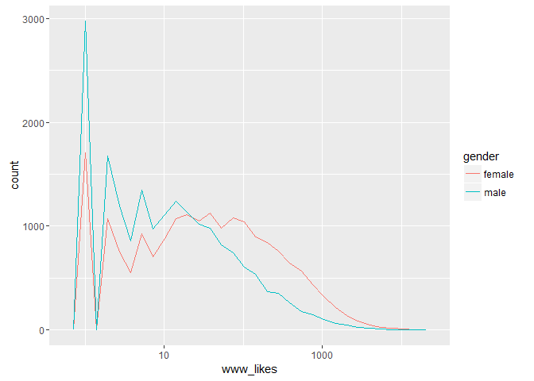

    by(pf$www_likes, pf$gender, sum)

    ## pf$gender: female
    ## [1] 3507665
    ## -------------------------------------------------------- 
    ## pf$gender: male
    ## [1] 1430175

### Friend Count box-plot

    qplot(x = gender, y = friend_count,
          geom = 'boxplot',
          data = subset(pf, !is.na(gender)))

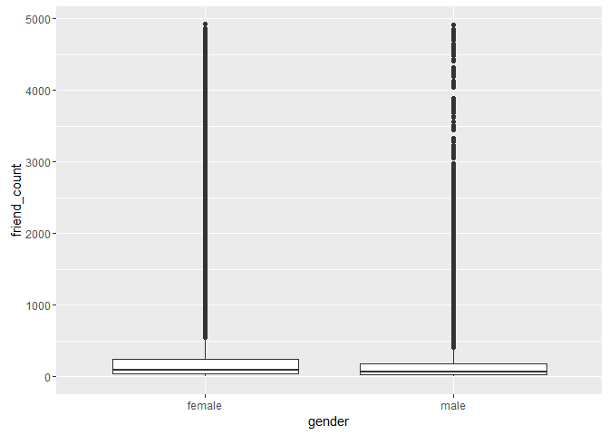

### Limiting y-scale

    qplot(x = gender, y = friend_count,
          geom = 'boxplot',
          data = subset(pf, !is.na(gender))) +
      coord_cartesian(ylim = c(0,250))

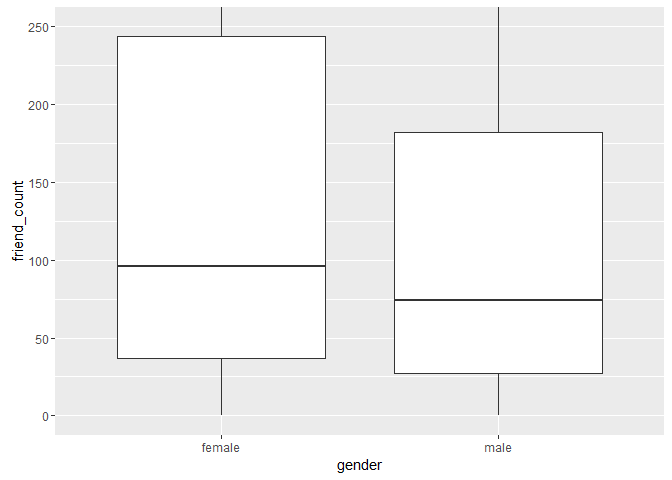

### Friendships Initiated

    qplot(x = gender, y = friendships_initiated,
          data = subset(pf, !is.na(gender)),
          geom = 'boxplot') + 
      coord_cartesian(ylim = c(0,150))

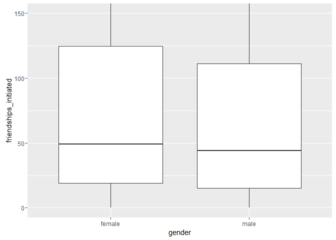

    by(pf$friendships_initiated, pf$gender, summary)

    ## pf$gender: female
    ##    Min. 1st Qu.  Median    Mean 3rd Qu.    Max. 
    ##     0.0    19.0    49.0   113.9   124.8  3654.0 
    ## -------------------------------------------------------- 
    ## pf$gender: male
    ##    Min. 1st Qu.  Median    Mean 3rd Qu.    Max. 
    ##     0.0    15.0    44.0   103.1   111.0  4144.0

### Mobile Log-in

    mobile_check_in <- NA
    pf$mobile_check_in <- ifelse(pf$mobile_likes>0, 1, 0)
    pf$mobile_check_in <- factor(pf$mobile_check_in)
    summary(pf$mobile_check_in)

    ##     0     1 
    ## 35056 63947

Bivariate Analysis
------------------

### Scatterplots and Perceived Audience Size

    qplot(x = age, y = friend_count, data = pf)

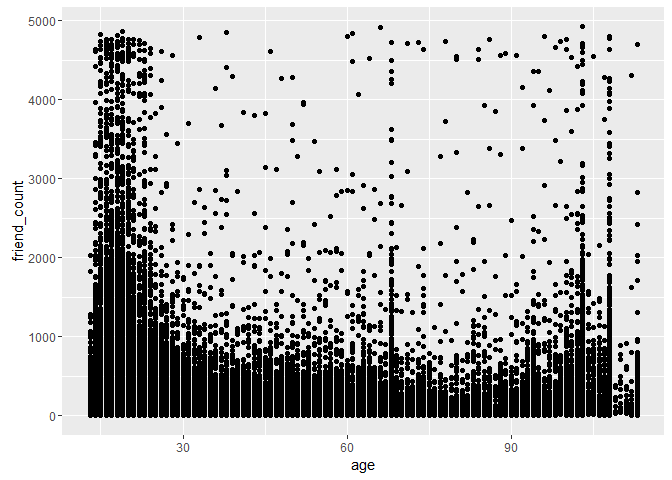

### Limiting x-scale

    ggplot(aes(x = age, y = friend_count), data = pf) + geom_point() + xlim(13, 90)

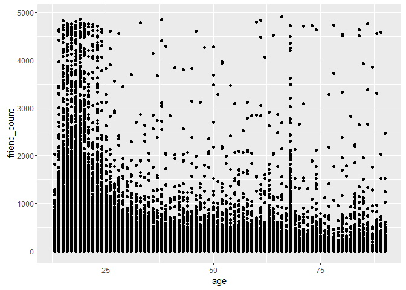

### Overplotting

    ggplot(aes(x = age, y = friend_count), data = pf) + 
      geom_jitter(alpha = 1/20) + 
      xlim(13, 90)

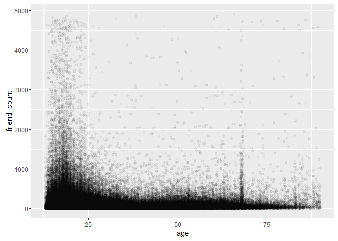

    ggplot(aes(x = age, y = friend_count), data = pf) + 
      geom_point(alpha = 1/20, position = position_jitter(h=0), color = 'orange') + 
      xlim(13, 90)+ coord_trans(y = 'sqrt')

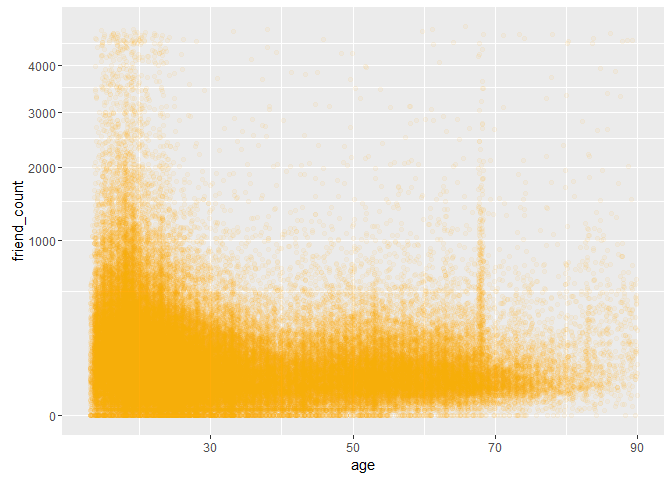

### Alpha and Jitter

    ggplot(aes(x = age, y = friendships_initiated), data = pf) +
      geom_jitter(alpha = 1/10, position = position_jitter(h=0)) + 
      coord_trans(y = 'sqrt')

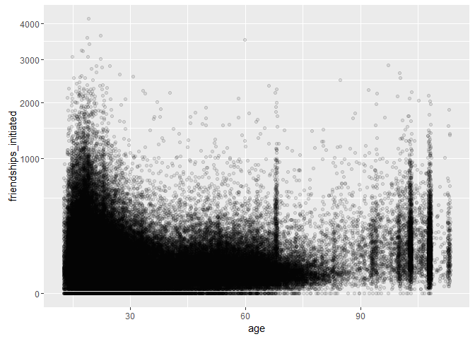

### Conditional Means

    library(dplyr)

    age_groups <- group_by(pf, age)
    pf.fc_by_age <- summarise(age_groups,
                    friend_count_mean = mean(friend_count),
                    friend_count_median = median(friend_count),
                    n = n())

    ggplot(aes(x = age, y = friend_count_mean), data = pf.fc_by_age) +
      geom_line()

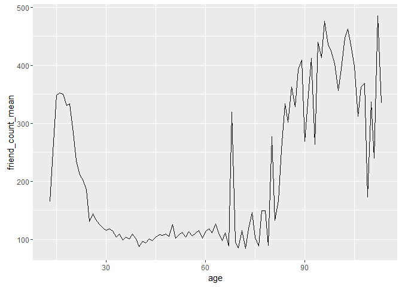

### Overlaying Summaries with Raw Data

    ggplot(aes(x = age, y = friend_count), data = pf) + 
      
      geom_point(alpha = 1/20, position = position_jitter(h=0), color = 'orange') + 
      
      xlim(13, 90)+ coord_trans(y = 'sqrt') + 
      
      geom_line(stat = 'summary', fun.y = mean) +
      geom_line(stat = 'summary', fun.y = quantile, fun.args = list(probs = .1),
                linetype = 2, color = 'blue') +
      geom_line(stat = 'summary', fun.y = quantile, fun.args = list(probs = .5),
                color = 'blue') +
      geom_line(stat = 'summary', fun.y = quantile, fun.args = list(probs = .9),
                color = 'blue', linetype = 2)

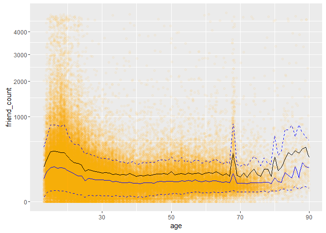

### Correlation

    cor.test(pf$age, pf$friend_count)

    ## 
    ##  Pearson's product-moment correlation
    ## 
    ## data:  pf$age and pf$friend_count
    ## t = -8.6268, df = 99001, p-value < 2.2e-16
    ## alternative hypothesis: true correlation is not equal to 0
    ## 95 percent confidence interval:
    ##  -0.03363072 -0.02118189
    ## sample estimates:
    ##         cor 
    ## -0.02740737

### Correlation on Subsets

    with(subset(pf, age <= 70), cor.test(age, friend_count))

    ## 
    ##  Pearson's product-moment correlation
    ## 
    ## data:  age and friend_count
    ## t = -52.592, df = 91029, p-value < 2.2e-16
    ## alternative hypothesis: true correlation is not equal to 0
    ## 95 percent confidence interval:
    ##  -0.1780220 -0.1654129
    ## sample estimates:
    ##        cor 
    ## -0.1717245

Create Scatterplots
-------------------

    ggplot(aes(x = www_likes_received, y = likes_received), data = pf) +
      geom_point()

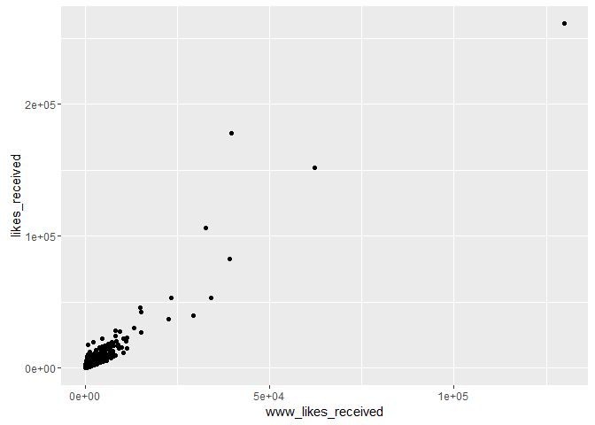

### Strong Correlations

    ggplot(aes(x = www_likes_received, y = likes_received), data = pf) +
      geom_point() +
      xlim(0, quantile(pf$www_likes_received, 0.95)) +
      ylim(0, quantile(pf$likes_received, 0.95)) +
      geom_smooth(method = 'lm', color = 'red')

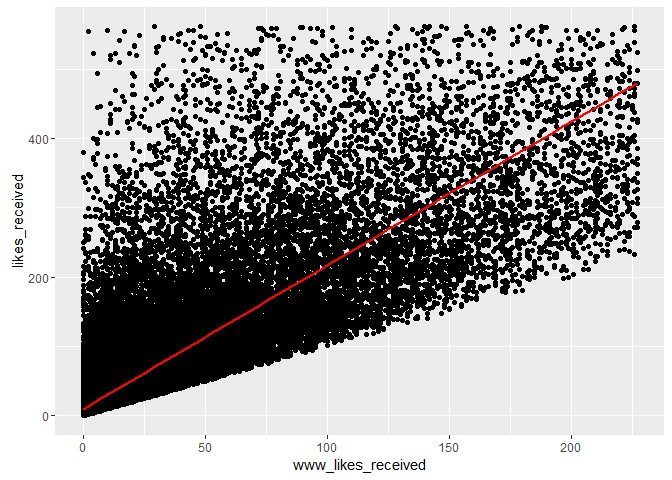

    with(pf, cor.test(pf$www_likes_received, pf$likes_received))

    ## 
    ##  Pearson's product-moment correlation
    ## 
    ## data:  pf$www_likes_received and pf$likes_received
    ## t = 937.1, df = 99001, p-value < 2.2e-16
    ## alternative hypothesis: true correlation is not equal to 0
    ## 95 percent confidence interval:
    ##  0.9473553 0.9486176
    ## sample estimates:
    ##       cor 
    ## 0.9479902

### Understanding Noise: Age to Age Months

    pf$age_with_months <- pf$age + (12 - pf$dob_month)/12

### Age with Months Means

    age_month_groups <- group_by(pf, age_with_months)
    pf.fc_by_age_month <- summarise(age_month_groups,
                                    mean_friend_count = mean(friend_count),
                                    median_friend_count = median(friend_count),
                                    n = n())
    pf.fc_by_age_month = arrange(pf.fc_by_age_month)

    ggplot(aes(x = age_with_months, y = mean_friend_count),
           data = subset(pf.fc_by_age_month, age_with_months < 71)) + 
      geom_line()

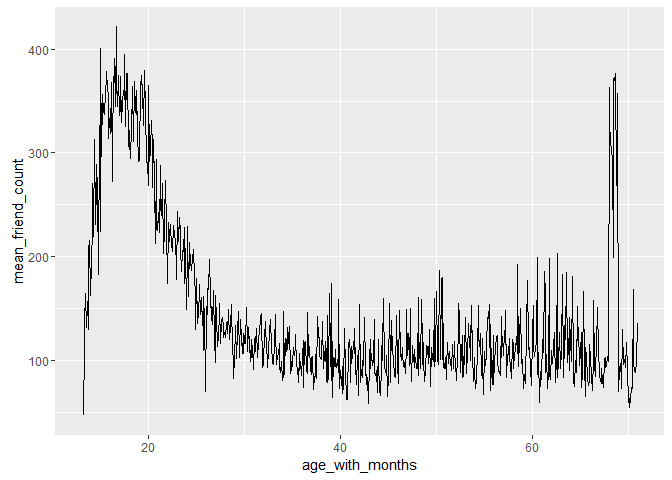

### Noise in Conditional Means

    p1 <- ggplot(aes(x = age, y = friend_count_mean),
           data = subset(pf.fc_by_age, age < 71)) +
      geom_line() +
      geom_smooth()

    p2 <- ggplot(aes(x = age_with_months, y = mean_friend_count),
           data = subset(pf.fc_by_age_month, age_with_months < 71)) + 
      geom_line() + 
      geom_smooth()

    p3 <- ggplot(aes(x = round(age/5) * 5, y = friend_count),
                 data = subset(pf, pf$age < 71)) + 
      geom_line(stat = 'summary', fun.y = mean)

    grid.arrange(p1, p2, p3, ncol = 1)

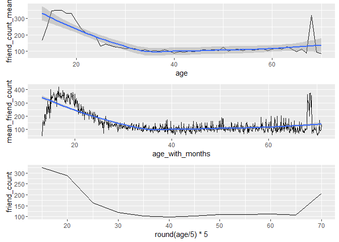

Multivariate Analysis
---------------------

    ggplot(aes(x = gender, y = age),
           data = subset(pf, !is.na(gender))) + geom_boxplot() + 
      stat_summary(fun.y = mean, geom = 'point', shape = 4)

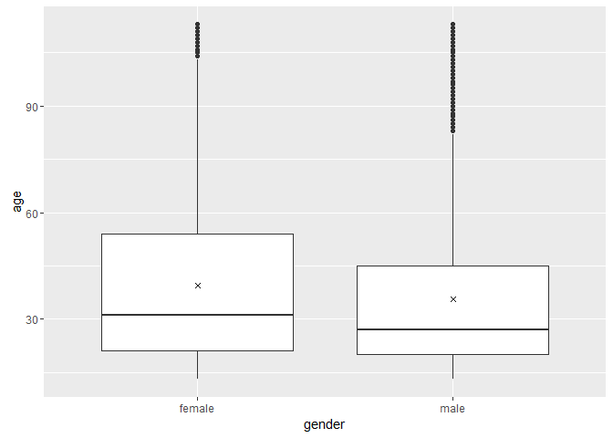

    ggplot(aes(x = age, y = friend_count),
           data = subset(pf, !is.na(gender))) + 
      geom_line(stat = 'summary', fun.y = median, aes(color = gender))

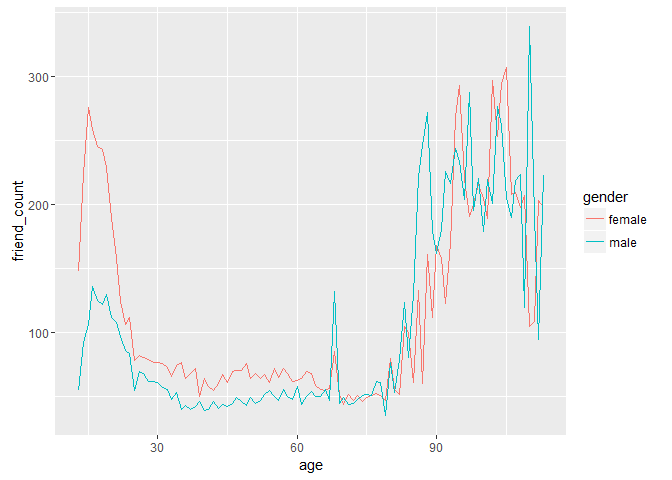

### Plotting Conditional Summaries

    pf.fc_by_age_gender <- pf %>%
      filter(!is.na(gender)) %>%
      group_by(age, gender) %>%
      summarize(mean_friend_count = mean(friend_count),
                median_friend_count = median(friend_count),
                n = n()) %>%
      ungroup() %>%
      arrange(age)

    ggplot(aes(x = age, y = median_friend_count),
           data = pf.fc_by_age_gender) +
      geom_line(aes(color = gender))

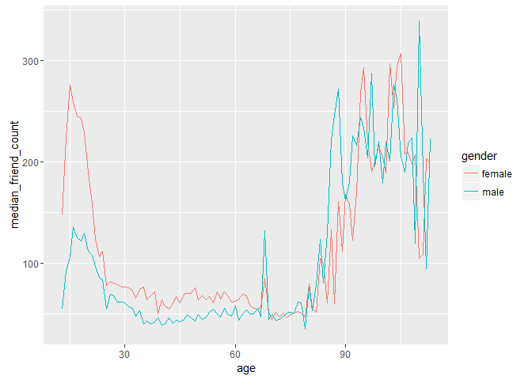

### Reshaping Data

    library(reshape2)

    pf.fc_by_age_gender.wide <- dcast(pf.fc_by_age_gender,
                                      age ~ gender,
                                      value.var = 'median_friend_count')

### Ratio Plot

    ggplot(aes(x = age, y = female/male),
           data = pf.fc_by_age_gender.wide) +
      geom_line() + 
      geom_hline(linetype = 2, yintercept = 1, alpha = 0.3)

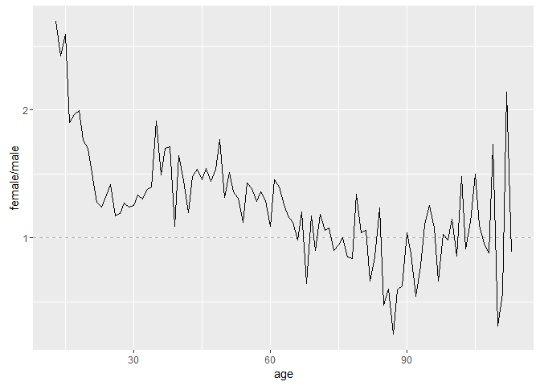

### Third Quantitative Variable

    pf$year_joined <- floor(2014 - pf$tenure/365)

### Cut a Variable

    pf$year_joined_bucket <- cut(pf$year_joined,
                                 c(2004, 2009, 2011, 2012, 2014))

### Plotting it All Together

    table(pf$year_joined_bucket, useNA = 'ifany')

    ## 
    ## (2004,2009] (2009,2011] (2011,2012] (2012,2014]        <NA> 
    ##        6669       15308       33366       43658           2

    ggplot(aes(x = age, y = friend_count),
           data = pf) +
      geom_line(aes(color = year_joined_bucket), stat = 'summary', fun.y = median)

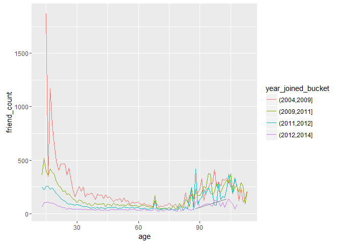

### Plot the Grand Mean

    ggplot(aes(x = age, y = friend_count),
           data = pf) +
      geom_line(aes(color = year_joined_bucket), 
                stat = 'summary',
                fun.y = mean) +
      geom_line(stat = 'summary', fun.y = mean, color = 'black')

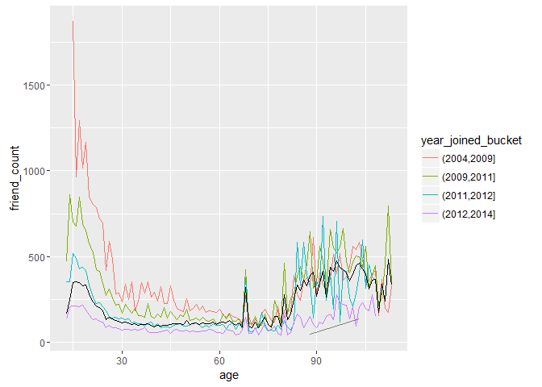

### Friending Rate

    with(subset(pf, tenure >=1), summary(friend_count/tenure))

    ##     Min.  1st Qu.   Median     Mean  3rd Qu.     Max. 
    ##   0.0000   0.0775   0.2205   0.6096   0.5658 417.0000

### Friendships Initiated

    ggplot(aes(y = friendships_initiated/tenure, x = tenure),
           data = subset(pf, tenure >= 1)) +
      geom_line(aes(color = year_joined_bucket), stat = 'summary', fun.y = mean)

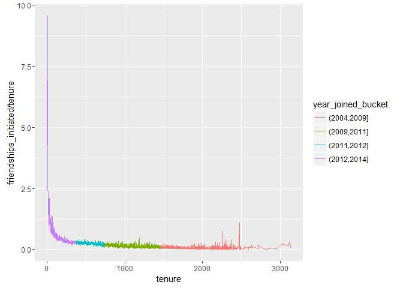

### Bias-Variance Tradeoff Revisited

    ggplot(aes(x = tenure, y = friendships_initiated / tenure),
           data = subset(pf, tenure >= 1)) +
      geom_line(aes(color = year_joined_bucket),
                stat = 'summary',
                fun.y = mean)

    ggplot(aes(x = 7 * round(tenure / 7), y = friendships_initiated / tenure),
           data = subset(pf, tenure > 0)) +
      geom_line(aes(color = year_joined_bucket),
                stat = "summary",
                fun.y = mean)

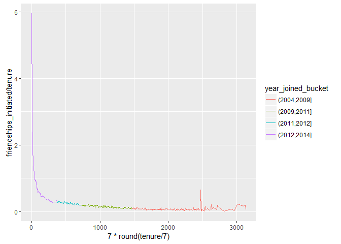

    ggplot(aes(x = 30 * round(tenure / 30), y = friendships_initiated / tenure),
           data = subset(pf, tenure > 0)) +
      geom_line(aes(color = year_joined_bucket),
                stat = "summary",
                fun.y = mean)

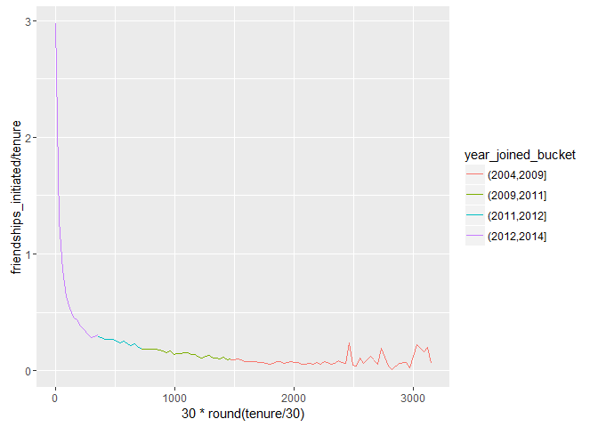

    ggplot(aes(x = 90 * round(tenure / 90), y = friendships_initiated / tenure),
           data = subset(pf, tenure > 0)) +
      geom_line(aes(color = year_joined_bucket),
                stat = "summary",
                fun.y = mean)

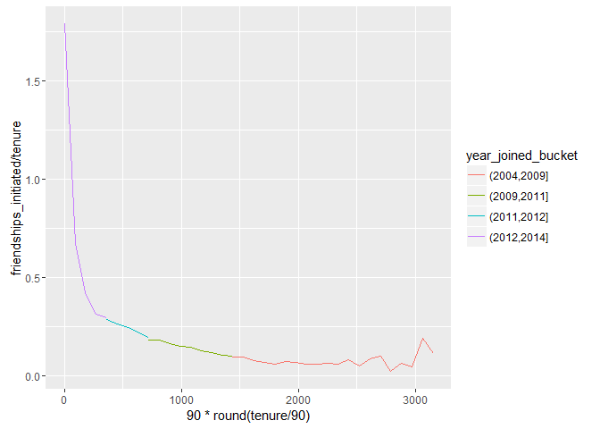

    #using line_smooth

    ggplot(aes(x = tenure, y = friendships_initiated / tenure),
           data = subset(pf, tenure >= 1)) +
      geom_smooth(aes(color = year_joined_bucket))

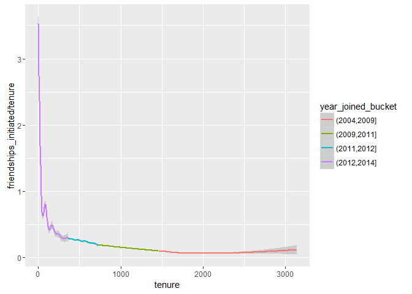
